# AI UI Generator — Pack diagrammes (Mermaid)

Ce document regroupe tous les diagrammes nécessaires au PFE **AI UI Generator**.

> Astuce : colle un bloc `mermaid` à la fois dans https://mermaid.live si besoin.

---

## A) Diagrammes UML structurels

### A1 — Diagramme de cas d’utilisation (Use Case)

**Description** : Interactions principales Utilisateur/Système/LLM. Les étapes internes de « Générer » sont modélisées en `<<include>>`.
**Type UML** : Use Case (flowchart)

```mermaid
flowchart LR
  %% Use Case UML (adapté en Mermaid flowchart)
  %% - Acteurs à l'extérieur de la frontière système
  %% - Cas d'utilisation à l'intérieur
  %% - <<include>> = sous-cas systématiques ; <<extend>> = optionnel

  U[Utilisateur]:::actor
  LLM[LLM (API externe)]:::external

  subgraph SYS["Système — AI UI Generator"]
    direction LR

    subgraph UC["Cas d'utilisation (vue utilisateur)"]
      direction TB
      UC1([Saisir un prompt]):::frontend
      UC2([Uploader des documents\n(PDF/DOCX/TXT/MD/PNG/JPG)]):::frontend
      UC3([Générer une interface UI]):::frontend
      UC4([Visualiser la preview]):::frontend
      UC5([Parcourir le code généré]):::frontend
      UC6([Consulter le rapport IA]):::frontend
      UC7([Modifier le UI Spec (patch)]):::frontend
      UC8([Comparer les versions (diff)]):::frontend
      UC9([Revenir à une version précédente\n(rollback)]):::frontend
      UC10([Exporter le code en ZIP]):::frontend
      UC11([Consulter l'historique des générations]):::frontend
    end

    subgraph INC["Sous-cas inclus (internes) — résumé"]
      direction TB
      I_UPLOAD([Valider upload + persister\n(MongoDB/MinIO) + audit + statuts]):::spring
      I_BUILD_SPEC([Construire UI Spec\n(Agent 3 + LLM)]):::fastapi
      I_VALIDATE([Valider UI Spec\n(schema/allowlist/a11y, retry x3)]):::fastapi
      I_CODEGEN([Générer code React\n(Agent 5, déterministe)]):::fastapi
      I_VERSION([Versionner\n(UI Spec + Code + Report)\n+ activeVersion]):::spring

      I_PATCH([Appliquer JSON Patch\n+ vérifier baseVersion]):::spring
      I_CONFLICT([Conflit 409\n(version obsolète)]):::spring
      I_CODE_ONLY([Codegen uniquement\n(mode: codegen_only)]):::fastapi

      I_DIFF([Calculer diff versions]):::spring
      I_ROLL([Rollback\n(nouvelle version + activeVersion)]):::spring
      I_ZIP([Exporter ZIP\n(version active)]):::spring
      I_HIST([Consulter historique\n(par sessionId)]):::spring
    end
  end

  %% L'utilisateur déclenche les cas d'utilisation
  U --> UC1
  U --> UC2
  U --> UC3
  U --> UC4
  U --> UC5
  U --> UC6
  U --> UC7
  U --> UC8
  U --> UC9
  U --> UC10
  U --> UC11

  %% Relations include / extend
  UC2 -. "<<extend>> (optionnel)" .-> UC3

  UC3 -. "<<include>>" .-> I_UPLOAD
  UC3 -. "<<include>>" .-> I_BUILD_SPEC
  UC3 -. "<<include>>" .-> I_VALIDATE
  UC3 -. "<<include>>" .-> I_CODEGEN
  UC3 -. "<<include>>" .-> I_VERSION

  UC7 -. "<<include>>" .-> I_PATCH
  UC7 -. "<<include>>" .-> I_CONFLICT
  UC7 -. "<<include>>" .-> I_CODE_ONLY
  UC7 -. "<<include>>" .-> I_VERSION

  UC8 -. "<<include>>" .-> I_DIFF
  UC9 -. "<<include>>" .-> I_ROLL
  UC10 -. "<<include>>" .-> I_ZIP
  UC11 -. "<<include>>" .-> I_HIST

  %% Acteur externe sollicité uniquement pour la construction du UI Spec
  LLM --- I_BUILD_SPEC

  classDef actor fill:#ffffff,stroke:#111827,color:#111827;
  classDef external fill:#fef9c3,stroke:#ca8a04,color:#713f12;
  classDef frontend fill:#dbeafe,stroke:#2563eb,color:#1e3a8a;
  classDef spring fill:#dcfce7,stroke:#16a34a,color:#052e16;
  classDef fastapi fill:#ffedd5,stroke:#ea580c,color:#7c2d12;
  classDef db fill:#f3f4f6,stroke:#6b7280,color:#111827;
```

#### A1.1 — Détail (zoom) : UC3 « Générer une interface UI »

**But** : à afficher seulement si on te demande "comment ça marche". Ici, on déroule les sous-étapes internes sans afficher tous les autres cas d'utilisation.

```mermaid
flowchart TD
  U[Utilisateur]:::actor
  FE[React (UI)]:::frontend
  BFF[Spring BFF (API publique)]:::spring
  AI[FastAPI (pipeline IA)]:::fastapi
  DB[(MongoDB)]:::db
  S3[(MinIO)]:::db
  LLM[LLM API externe]:::external

  U -->|prompt + fichiers (optionnels)| FE
  FE -->|POST /api/generations| BFF

  BFF --> V[Valider prompt + fichiers\n(MIME/taille/SHA256/sanitation)]:::spring
  BFF --> A[Créer génération + audit\n+ statut PENDING/PROCESSING]:::spring
  V --> STO[Stocker fichiers + fileRefs]:::spring
  STO --> S3
  A --> DB

  BFF -->|POST /internal/generate| AI

  AI --> EX[Extraction texte (docs) + OCR (images)]:::fastapi
  EX --> SPEC[Construire UI Spec draft]:::fastapi
  SPEC -->|Completion| LLM
  LLM --> SPEC

  SPEC --> VAL[Valider UI Spec\n(schema + allowlist + a11y)\nretry x3]:::fastapi
  VAL --> CG[Générer code React\n(Agent 5, déterministe)]:::fastapi
  CG --> REP[Construire AI Report]:::fastapi
  REP -->|Résultat| BFF

  BFF --> VER[Versionner\n(UI Spec + Code + Report)\n+ activeVersion]:::spring
  VER --> DB

  classDef actor fill:#ffffff,stroke:#111827,color:#111827;
  classDef external fill:#fef9c3,stroke:#ca8a04,color:#713f12;
  classDef frontend fill:#dbeafe,stroke:#2563eb,color:#1e3a8a;
  classDef spring fill:#dcfce7,stroke:#16a34a,color:#052e16;
  classDef fastapi fill:#ffedd5,stroke:#ea580c,color:#7c2d12;
  classDef db fill:#f3f4f6,stroke:#6b7280,color:#111827;
```

### A2 — Diagramme de classes — Modèle MongoDB

**Description** : 6 collections MongoDB, champs principaux et relations 1-N via `generationId`.
**Type UML** : Class

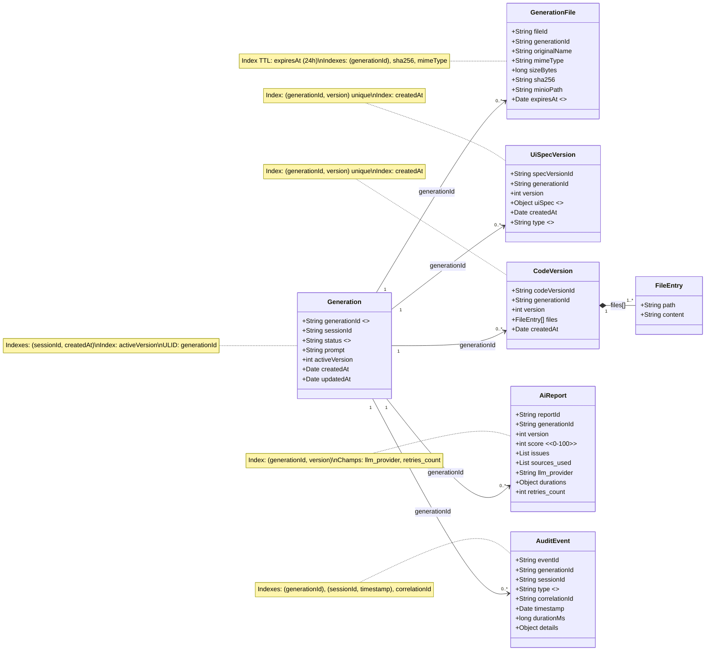

### A3 — Diagramme de classes — Spring Boot (BFF)

**Description** : Controllers, services, validation, audit et client FastAPI (relations Controller → Service → (DB/MinIO/Client)).
**Type UML** : Class

```mermaid
classDiagram
  direction LR

  class GenerationController {
    +POST /api/generations(multipart)
    +GET /api/generations/{id}
    +POST /api/generations/{id}/patch-spec
    +POST /api/generations/{id}/rollback
  }

  class SessionController {
    +GET /api/sessions/{sid}/history
  }

  class ExportController {
    +POST /api/generations/{id}/export
  }

  class GenerationService {
    +createGeneration(prompt, files)
    +getGeneration(id)
    +patchSpec(id, baseVersion, patches)
    +exportZip(id)
  }

  class GenerationRepository {
    <<MongoRepository>>
    +findById(generationId)
    +save(generation)
  }

  class GenerationFileRepository {
    <<MongoRepository>>
    +save(fileMeta)
    +findByGenerationId(generationId)
  }

  class UiSpecVersionRepository {
    <<MongoRepository>>
    +findByGenerationIdAndVersion(generationId, version)
    +save(uiSpecVersion)
  }

  class CodeVersionRepository {
    <<MongoRepository>>
    +findByGenerationIdAndVersion(generationId, version)
    +save(codeVersion)
  }

  class AiReportRepository {
    <<MongoRepository>>
    +save(aiReport)
  }

  class AuditEventRepository {
    <<MongoRepository>>
    +save(auditEvent)
  }

  class FileStorageService {
    +putToMinio(file) String
    +getFromMinio(path) bytes
  }

  class MinioClient {
    +putObject(bucket, path, bytes)
    +getObject(bucket, path) bytes
  }

  class VersioningService {
    +createInitialVersions(generationId, uiSpec, code)
    +applyJsonPatch(uiSpec, patches) uiSpec
    +setActiveVersion(generationId, version)
  }

  class AuditService {
    +recordEvent(type, correlationId, details)
  }

  class FastApiClient {
    +POST /internal/generate(payload)
    +GET /health()
  }

  class UploadValidator {
    +validatePrompt(prompt)
    +validateFiles(files)
    +computeSha256(file)
    +sanitizeFilename(name)
  }

  class CorrelationIdFilter {
    +doFilter(request, response)
    +ensureCorrelationId()
  }

  class GlobalExceptionHandler {
    +handleValidation()
    +handleConflict()
    +handleUnsupportedMediaType()
    +handleGeneric()
  }

  GenerationController --> UploadValidator
  GenerationController --> GenerationService
  SessionController --> GenerationService
  ExportController --> GenerationService

  GenerationService --> FileStorageService
  GenerationService --> VersioningService
  GenerationService --> AuditService
  GenerationService --> FastApiClient

  GenerationService --> GenerationRepository
  GenerationService --> GenerationFileRepository
  GenerationService --> UiSpecVersionRepository
  GenerationService --> CodeVersionRepository
  GenerationService --> AiReportRepository
  AuditService --> AuditEventRepository

  FileStorageService --> MinioClient

  CorrelationIdFilter ..> GenerationController : intercepte
  GlobalExceptionHandler ..> GenerationController : gère erreurs
```

### A4 — Diagramme de classes — FastAPI Agents

**Description** : Orchestrateur et agents (OCR, extraction docs, spec builder LLM, validation guardrails, codegen déterministe) + objets de transport.
**Type UML** : Class

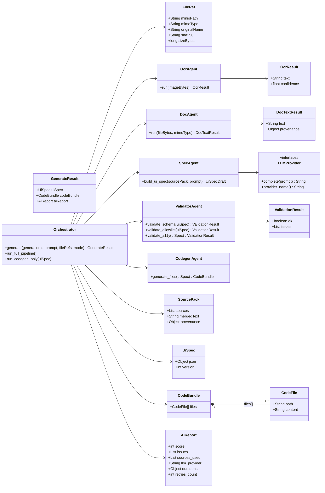

### A5 — Diagramme de composants

**Description** : Dépendances entre React, BFF Spring, Service IA FastAPI, MongoDB, MinIO et LLM externe.
**Type UML** : Component (flowchart)

```mermaid
flowchart LR
  FE[React Frontend\n(Vite + Tailwind + Monaco)]:::frontend
  BFF[Spring Boot BFF\n(API publique)]:::spring
  AI[FastAPI AI Service\n(agents 0..5)]:::fastapi
  DB[(MongoDB 7)]:::db
  S3[(MinIO S3)]:::db
  LLM[LLM API externe\n(OpenAI/Groq/Mistral/Ollama)]:::external

  FE -->|HTTP REST\n/api/*| BFF
  BFF -->|HTTP interne\n/internal/generate| AI
  BFF -->|MongoDB| DB
  BFF -->|S3 API| S3
  AI -->|S3 API| S3
  AI -->|HTTPS| LLM

  classDef frontend fill:#dbeafe,stroke:#2563eb,color:#1e3a8a;
  classDef spring fill:#dcfce7,stroke:#16a34a,color:#052e16;
  classDef fastapi fill:#ffedd5,stroke:#ea580c,color:#7c2d12;
  classDef db fill:#f3f4f6,stroke:#6b7280,color:#111827;
  classDef external fill:#fef9c3,stroke:#ca8a04,color:#713f12;
```

### A6 — Diagramme de déploiement

**Description** : Déploiement Docker (spring-bff, fastapi-ai, mongo, minio) + réseaux `frontend-net` et `backend-net` + LLM cloud.
**Type UML** : Deployment (flowchart)

```mermaid
flowchart TB
  subgraph WEB["Navigateur Web"]
    SPA[React SPA\n(exécutée côté client)]:::frontend
  end

  subgraph HOST["Docker Host"]
    direction TB

    subgraph NET1["Réseau: frontend-net"]
      direction LR
      BFF[spring-bff\n:8080 (EXPOSÉ)]:::spring
    end

    subgraph NET2["Réseau: backend-net"]
      direction LR
      AI[fastapi-ai\n:8000 (INTERNE)]:::fastapi
      DB[(mongo\n:27017 (INTERNE))]:::db
      S3[(minio\n:9000 (INTERNE))]:::db
      BFF2[spring-bff\n(attaché aussi au backend-net)]:::spring
    end
  end

  subgraph CLOUD["Cloud LLM (externe)"]
    LLM[OpenAI / Groq / Mistral / Ollama*]:::external
  end

  SPA -->|HTTP| BFF
  BFF2 -->|HTTP interne| AI
  BFF2 -->|MongoDB| DB
  BFF2 -->|S3 API| S3
  AI -->|S3 API| S3
  AI -->|HTTPS| LLM

  AI -. "FastAPI non accessible publiquement" .- SPA

  classDef frontend fill:#dbeafe,stroke:#2563eb,color:#1e3a8a;
  classDef spring fill:#dcfce7,stroke:#16a34a,color:#052e16;
  classDef fastapi fill:#ffedd5,stroke:#ea580c,color:#7c2d12;
  classDef db fill:#f3f4f6,stroke:#6b7280,color:#111827;
  classDef external fill:#fef9c3,stroke:#ca8a04,color:#713f12;
```

---

## B) Diagrammes UML comportementaux

### B1 — Séquence — Flux principal (génération complète)

**Description** : Flux complet : upload optionnel, persistance MinIO/Mongo, pipeline multi-agents, alt/loop pour validation OK/retry/échec.
**Type UML** : Sequence

```mermaid
sequenceDiagram
  autonumber
  participant U as Utilisateur
  participant R as React (SPA)
  participant S as Spring Boot (BFF)
  participant DB as MongoDB
  participant M as MinIO (S3)
  participant F as FastAPI (IA)
  participant A0 as Agent0 Orchestrateur
  participant A1 as Agent1 OCR
  participant A2 as Agent2 Extraction
  participant A3 as Agent3 UI Spec Builder (LLM)
  participant A4 as Agent4 Validation (guardrails)
  participant A5 as Agent5 Code Generator
  participant L as LLM API (externe)

  U->>R: Saisit prompt (+ fichiers optionnels)
  R->>S: POST /api/generations (multipart)
  S->>S: CorrelationIdFilter: générer correlationId + MDC
  S->>S: UploadValidator: valider prompt, MIME, taille, SHA256, sanitation
  S->>DB: insert generations(status=PENDING, sessionId, activeVersion=1)
  S->>DB: insert audit_events(type=GENERATION_REQUESTED, correlationId)

  alt Avec fichiers
    loop Pour chaque fichier
      S->>M: putObject(file)
      M-->>S: minioPath
      S->>DB: insert generation_files(meta + minioPath)
    end
  else Sans fichiers
    S->>S: Continuer sans upload
  end

  S->>DB: update generations(status=PROCESSING)
  S->>F: POST /internal/generate {generationId,prompt,fileRefs[],mode=full}
  F->>A0: orchestrate(generationId)

  alt Avec fichiers
    loop Pour chaque fileRef
      A0->>M: getObject(minioPath)
      alt Fichier image (PNG/JPG)
        A0->>A1: run(imageBytes)
        A1-->>A0: texte + confidence
      else Document (PDF/DOCX/TXT/MD)
        A0->>A2: run(fileBytes, mimeType)
        A2-->>A0: texte + provenance
      end
    end
    A0->>A0: Assembler SourcePack
  else Sans fichiers
    A0->>A0: SourcePack vide (prompt seul)
  end

  A0->>A3: build_ui_spec(SourcePack, prompt)
  A3->>L: Completion(prompt construit)
  L-->>A3: UI Spec draft
  A3-->>A0: UI Spec draft

  loop Tentatives de validation (max 3)
    A0->>A4: validate_schema(uiSpec)
    A4-->>A0: OK/ERREUR
    A0->>A4: validate_allowlist(uiSpec)
    A4-->>A0: OK/ERREUR
    A0->>A4: validate_a11y(uiSpec)
    A4-->>A0: OK/ERREUR

    alt Valide
      A0->>A5: generate_files(uiSpec validé)
      A5-->>A0: CodeBundle
      A0-->>F: {uiSpec, codeBundle, aiReport}
      break
    else Invalide
      opt Si tentatives restantes (< 3)
        A0->>A3: Re-générer UI Spec (prompt renforcé)
        A3->>L: Completion()
        L-->>A3: UI Spec draft (nouvelle tentative)
        A3-->>A0: UI Spec draft
      end
    end
  end

  alt Échec après max retries (toujours invalide)
    F-->>S: 500 {erreur: validation échouée x3}
    S->>DB: update generations(status=FAILED)
    S->>DB: insert audit_events(type=GENERATION_FAILED, correlationId)
    S-->>R: 500 Erreur génération
  else Succès
    F-->>S: 200 {uiSpec, codeBundle, aiReport}
    S->>DB: insert ui_spec_versions(version=1,type=INITIAL)
    S->>DB: insert code_versions(version=1)
    S->>DB: insert ai_reports(version=1)
    S->>DB: update generations(status=COMPLETED)
    S->>DB: insert audit_events(type=GENERATION_COMPLETED, correlationId)
    S-->>R: 201 {generationId, sessionId, status=COMPLETED}
    R-->>U: Affiche preview + code + rapport
  end
```

### B2 — Séquence — Flux patch

**Description** : Patch JSON + contrôle `baseVersion`, conflit 409, codegen_only via Agent5, nouvelle version persistée.
**Type UML** : Sequence

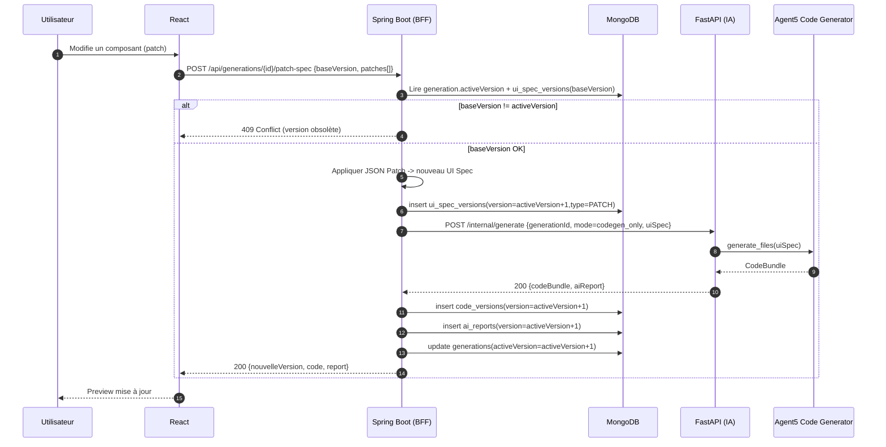

### B3 — Séquence — Export ZIP

**Description** : Lecture version active, génération ZIP et streaming.
**Type UML** : Sequence

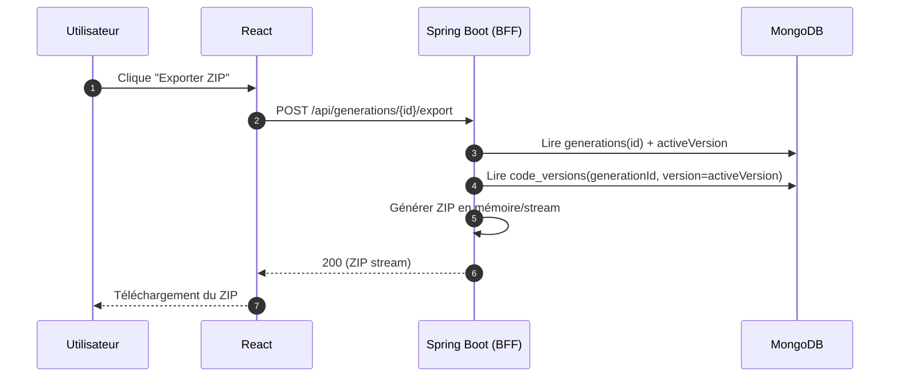

### B4 — Séquence — Rollback

**Description** : Copie UI Spec target en nouvelle version ROLLBACK + mise à jour `activeVersion`.
**Type UML** : Sequence

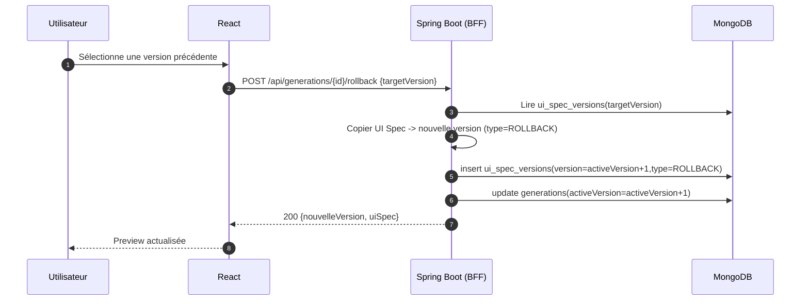

### B5 — Séquence — Interception (CorrelationIdFilter)

**Description** : Corrélation requête/réponse + audit event.
**Type UML** : Sequence

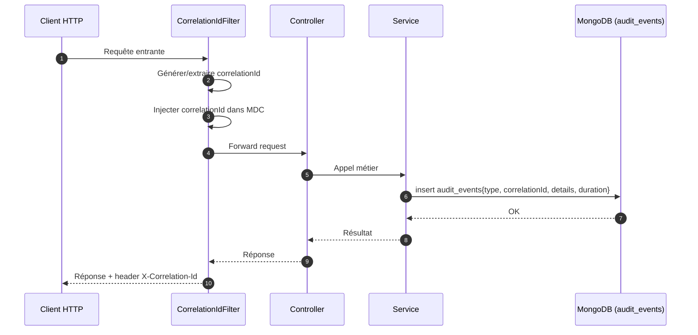

### B6 — Activité — Pipeline IA complet

**Description** : Fork/join par fichier, LLM, validations et boucle retry max 3.
**Type UML** : Activity

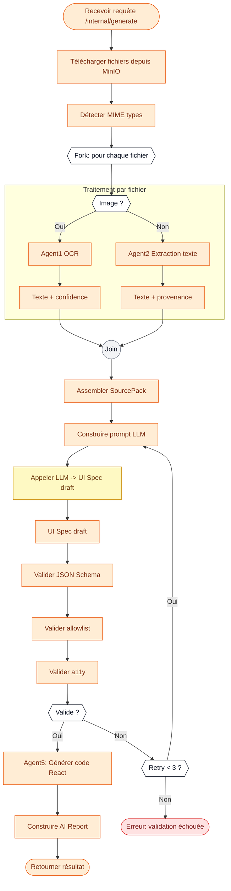

### B7 — Activité — Upload + Validation

**Description** : Validation prompt/fichiers, erreurs 400/413/415, persistance et appel FastAPI.
**Type UML** : Activity

```mermaid
flowchart TD
  A([Recevoir POST /api/generations (multipart)]):::spring
  B[ Vérifier prompt non vide ]:::spring
  C{{Prompt valide ?}}:::decision
  E400([Erreur 400 Bad Request]):::error

  A --> B --> C
  C -->|Non| E400
  C -->|Oui| LOOP{{Pour chaque fichier}}:::decision

  LOOP --> V1[ Vérifier MIME (allowlist) ]:::spring
  V1 --> MOK{{MIME OK ?}}:::decision
  MOK -->|Non| E415([Erreur 415 Unsupported Media Type]):::error

  MOK -->|Oui| V2[ Vérifier taille (limite) ]:::spring
  V2 --> TOK{{Taille OK ?}}:::decision
  TOK -->|Non| E413([Erreur 413 Payload Too Large]):::error

  TOK -->|Oui| V3[ Calculer SHA256 ]:::spring
  V3 --> V4[ Sanitize filename ]:::spring
  V4 --> V5[ Stocker fichier dans MinIO ]:::spring
  V5 --> NEXT{{Autre fichier ?}}:::decision
  NEXT -->|Oui| LOOP
  NEXT -->|Non| ALL{{Tous valides ?}}:::decision

  ALL -->|Non| E400
  ALL -->|Oui| P1[ Persister métadonnées MongoDB ]:::spring
  P1 --> AU[ Créer audit event ]:::spring
  AU --> CALL[ Appeler FastAPI /internal/generate ]:::spring
  CALL --> OUT([Retourner {generationId, sessionId, status}]):::spring

  classDef spring fill:#dcfce7,stroke:#16a34a,color:#052e16;
  classDef decision fill:#ffffff,stroke:#111827,color:#111827;
  classDef error fill:#fee2e2,stroke:#dc2626,color:#7f1d1d;
```

### B8 — États — Cycle de vie d’une génération

**Description** : PENDING → PROCESSING → COMPLETED/FAILED, avec patch/rollback comme self-transition sur COMPLETED.
**Type UML** : State

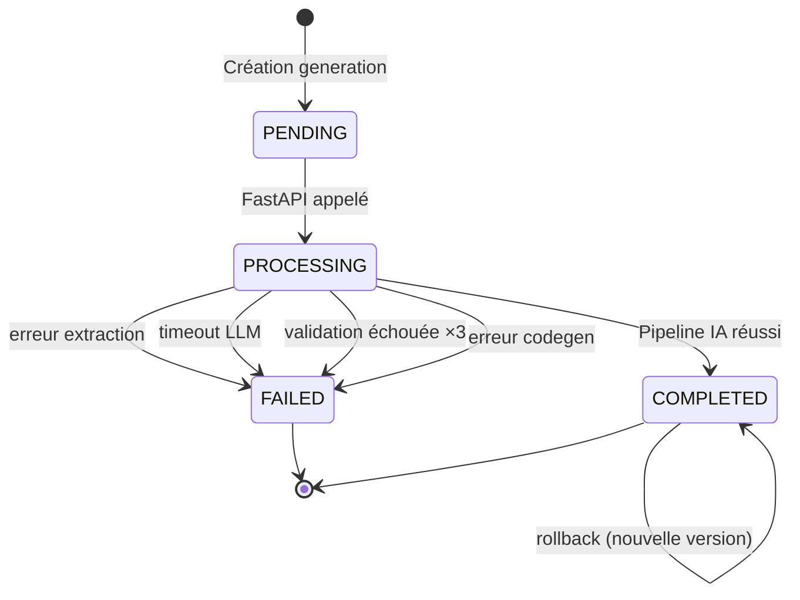

---

## C) Diagrammes architecturaux (non-UML)

### C1 — Architecture globale (Context)

**Description** : Utilisateur ↔ Système ↔ LLM provider externe + stockage.
**Type UML** : Flowchart

```mermaid
flowchart LR
  U[Utilisateur]:::actor

  subgraph SYS["AI UI Generator"]
    APP[Application Web\n(React + Spring BFF + FastAPI)]:::system
    DATA[(MongoDB + MinIO)]:::store
  end

  LLM[LLM Provider\n(OpenAI/Groq/Mistral/Ollama*)]:::external

  U -->|Prompt + documents| APP
  APP -->|Preview + code + rapport| U

  APP -->|Persistance| DATA
  DATA -->|Fichiers + versions| APP

  APP -->|Appels LLM (Agent 3)| LLM
  LLM -->|UI Spec draft| APP

  classDef actor fill:#ffffff,stroke:#111827,color:#111827;
  classDef system fill:#dbeafe,stroke:#2563eb,color:#1e3a8a;
  classDef store fill:#f3f4f6,stroke:#6b7280,color:#111827;
  classDef external fill:#fef9c3,stroke:#ca8a04,color:#713f12;
```

### C2 — Architecture détaillée (Container)

**Description** : Containers + protocoles.
**Type UML** : Flowchart

```mermaid
flowchart LR
  U[Utilisateur]:::actor
  R[React SPA]:::frontend
  BFF[Spring Boot BFF]:::spring
  AI[FastAPI AI Service]:::fastapi
  DB[(MongoDB)]:::db
  S3[(MinIO S3)]:::db
  LLM[LLM API (HTTPS)]:::external

  U -->|HTTP| R
  R -->|HTTP REST /api/*| BFF
  BFF -->|HTTP interne /internal/generate| AI
  BFF -->|MongoDB| DB
  BFF -->|S3 API| S3
  AI -->|S3 API| S3
  AI -->|HTTPS| LLM

  classDef frontend fill:#dbeafe,stroke:#2563eb,color:#1e3a8a;
  classDef spring fill:#dcfce7,stroke:#16a34a,color:#052e16;
  classDef fastapi fill:#ffedd5,stroke:#ea580c,color:#7c2d12;
  classDef db fill:#f3f4f6,stroke:#6b7280,color:#111827;
  classDef external fill:#fef9c3,stroke:#ca8a04,color:#713f12;
  classDef actor fill:#ffffff,stroke:#111827,color:#111827;
```

### C3 — Pipeline multi-agents

**Description** : Chaîne Agent0→(Agent1/2)→SourcePack→Agent3+LLM→Agent4→Agent5 + sorties.
**Type UML** : Flowchart

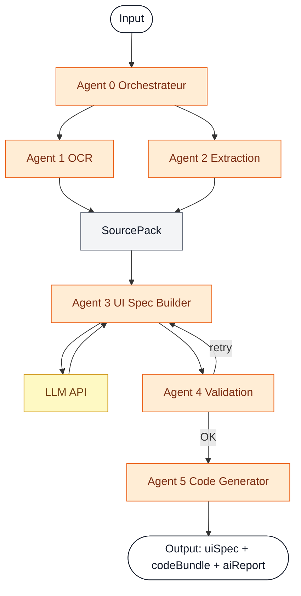

### C4 — ERD MongoDB

**Description** : Entités + relations 1-N via generationId + TTL.
**Type UML** : ER

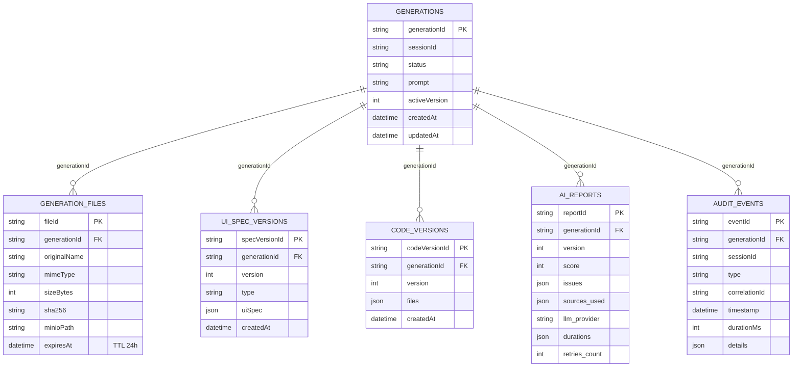

### C5 — Data Flow Diagram

**Description** : Processus + data stores + flux.
**Type UML** : Flowchart

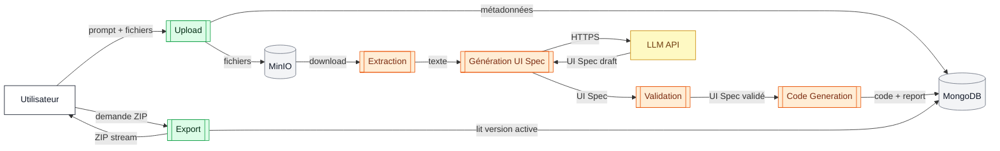

### C6 — Réseau Docker

**Description** : 2 réseaux, ports exposés vs internes, FastAPI non public.
**Type UML** : Flowchart

```mermaid
flowchart TB
  EXT[Machine hôte / Internet]:::actor
  BROWSER[Navigateur]:::frontend

  subgraph DOCKER["Docker Compose"]
    direction TB

    subgraph FN["frontend-net"]
      BFF_EX[spring-bff\n8080 publié]:::spring
    end

    subgraph BN["backend-net"]
      BFF_IN[spring-bff\n8080 interne]:::spring
      AI[fastapi-ai\n8000 interne]:::fastapi
      DB[(mongo\n27017 interne)]:::db
      S3[(minio\n9000 interne)]:::db
    end
  end

  EXT --> BROWSER
  BROWSER -->|HTTP| BFF_EX
  BFF_IN -->|HTTP interne| AI
  BFF_IN -->|MongoDB| DB
  BFF_IN -->|S3 API| S3
  AI -->|S3 API| S3

  EXT -. "FastAPI non exposé" .- AI

  classDef actor fill:#ffffff,stroke:#111827,color:#111827;
  classDef frontend fill:#dbeafe,stroke:#2563eb,color:#1e3a8a;
  classDef spring fill:#dcfce7,stroke:#16a34a,color:#052e16;
  classDef fastapi fill:#ffedd5,stroke:#ea580c,color:#7c2d12;
  classDef db fill:#f3f4f6,stroke:#6b7280,color:#111827;
```

---

## D) Diagrammes de planification

### D1 — Gantt — 13 sprints

**Description** : 13 sprints (2 semaines) avec jalons MVP/Feature Complete/Soutenance.
**Type UML** : Gantt

```mermaid
gantt
  title Planification PFE — 13 sprints (2 semaines)
  dateFormat  YYYY-MM-DD
  axisFormat  %d/%m
  excludes    weekends

  section Cadrage & Setup
  S1 — Cadrage, CDC, architecture            :s1, 2026-03-02, 14d
  S2 — Setup dev (Docker, repo, CI)          :s2, after s1, 14d

  section Frontend
  S3 — UI PromptPage + upload                :s3, after s2, 14d
  S4 — ResultPage (preview + Monaco)         :s4, after s3, 14d

  section Backend BFF (Spring)
  S5 — API generations + validation upload   :s5, after s2, 14d
  S6 — Persistance Mongo + MinIO + audit     :s6, after s5, 14d

  section Service IA (FastAPI)
  S7 — Agents extraction (OCR/Docs)          :s7, after s2, 14d
  S8 — Agent3 LLM + Agent4 validation + retry:s8, after s7, 14d
  MVP (fin S8)                               :milestone, mvp, after s8, 0d

  section Versioning & features avancées
  S9 — Agent5 codegen + templates            :s9, after s8, 14d
  S10 — Patch UI Spec + codegen_only         :s10, after s9, 14d
  S11 — Export ZIP + HistoryPage             :s11, after s10, 14d
  S12 — Hardening (erreurs, perf, tests)     :s12, after s11, 14d
  Feature Complete (fin S12)                 :milestone, fc, after s12, 0d

  section Finalisation
  S13 — Documentation + démo + soutenance    :s13, after s12, 14d
  Soutenance (fin S13)                       :milestone, sout, after s13, 0d
```
